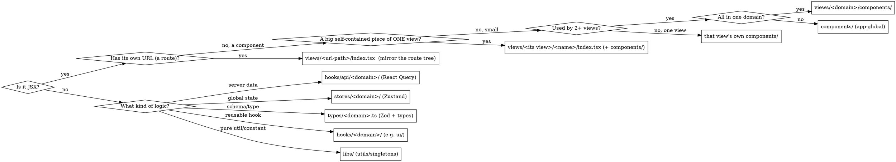

# React Monorepo (epub-reader)

A pnpm + Turborepo workspace: a React 19 / Vite app, shared workspace packages, and a Rust→WASM pipeline. This skill is self-contained — it covers both the **monorepo** (workspaces, shared UI/config, WASM build, commands) and the **in-app `src/` architecture** (routes, views, state, data, types).

**Core principle for app code:** organize by **feature inside `views/`**, by **type everywhere else**. A route file is thin and delegates to a *view*; a view is composition-only UI; all logic (data, state, validation, types, utils) lives in a typed home outside the view and is imported in. Shared UI primitives, `cn`, and global CSS come from `@workspace/ui`.

---

# Part 1 — The monorepo

## Layout

```
epub-reader/
  apps/
    web/                    # "web" — React 19 + Vite reader client (the frontend)
  packages/
    ui/                     # "@workspace/ui" — shared shadcn / Base UI design system
    eslint-config/          # "@workspace/eslint-config" — shared flat ESLint config
    tsconfig/               # "@workspace/tsconfig" — shared tsconfig bases
  crates/
    core/                   # "core"   (Rust) — EPUB engine: domain model (pure data)
    parser/                 # "parser" (Rust) — EPUB parser: bytes → Book
    wasm/                   # "wasm-src" pkg (build scripts) + Rust crate "wasm"
      pkg/                  # wasm-pack output — the JS package named "wasm" (generated, gitignored)
  Cargo.toml                # cargo workspace: crates/core, crates/parser, crates/wasm
  pnpm-workspace.yaml       # pnpm workspaces: apps/*, crates/wasm, crates/wasm/pkg, packages/*
  turbo.json                # turbo task graph
  package.json              # root scripts (pnpm@11.5.2)
  tsconfig.json             # extends @workspace/tsconfig/base.json
```

## Workspaces

| Path | Package name | What | Consumed as |
|---|---|---|---|
| `apps/web` | `web` | React app | — (the app itself) |
| `packages/ui` | `@workspace/ui` | shadcn + Base UI primitives, `cn`, global CSS | `@workspace/ui/*` |
| `packages/eslint-config` | `@workspace/eslint-config` | flat ESLint config | `@workspace/eslint-config/react` |
| `packages/tsconfig` | `@workspace/tsconfig` | tsconfig bases | `@workspace/tsconfig/{base,react}.json` |
| `crates/core`, `crates/parser` | `core`, `parser` | Rust engine libs — domain model + EPUB parser (cargo only, no package.json) | path deps of the `wasm` crate |
| `crates/wasm` | `wasm-src` | Rust wasm-bindgen bindings + build scripts | run via `pnpm wasm` |
| `crates/wasm/pkg` | `wasm` | wasm-pack JS/WASM output (generated) | `import … from "wasm"` |

Two "wasm" packages: **`wasm-src`** (`crates/wasm`) holds the Rust source and pnpm build scripts; **`wasm`** (`crates/wasm/pkg`) is the generated JS package the app imports.

## Shared UI — `@workspace/ui`

Base UI (`@base-ui/react`) + shadcn v4, style **`base-nova`**, base color neutral, lucide icons. Exports are **per-file — no barrels**:

| Import | Resolves to |
|---|---|
| `import "@workspace/ui/globals.css"` | `src/styles/globals.css` — Tailwind v4 entry + `@theme` tokens |
| `import { cn } from "@workspace/ui/lib/utils"` | `src/lib/utils.ts` |
| `import { Button } from "@workspace/ui/components/button"` | `src/components/button.tsx` |
| `import { useX } from "@workspace/ui/hooks/use-x"` | `src/hooks/use-x.ts` |

**Global CSS & theme tokens live once** in `packages/ui/src/styles/globals.css`, imported a single time in `apps/web/src/main.tsx`. New semantic tokens go there — there is **no per-app globals file**.

**Add a primitive in `packages/ui`, never in the app:**

```
cd packages/ui
pnpm dlx shadcn@latest add dialog      # -> packages/ui/src/components/dialog.tsx
```

Consume it app-side as `@workspace/ui/components/dialog`. Running shadcn from `packages/ui` uses `packages/ui/components.json` (base-nova, neutral, lucide). The app's own `apps/web/components.json` points `ui`/`utils` at `@workspace/ui` and `css` at the shared globals — only for pulling shadcn *blocks* into the app.

## Rust → WASM pipeline

A cargo workspace of three crates; `crates/wasm` (crate `wasm`, edition 2024, `crate-type = ["cdylib","rlib"]`, `wasm-bindgen`) wraps `core` + `parser` (path deps) and is compiled with `wasm-pack`.

**Build** — `pnpm wasm` at root (= `pnpm --dir crates/wasm build`):

```
wasm-pack build --target web                              # -> crates/wasm/pkg/ (JS glue + wasm_bg.wasm)
mkdir -p ../../apps/web/public
cp pkg/wasm_bg.wasm ../../apps/web/public/wasm_bg.wasm
```

Two outputs: the `pkg/` JS package (named **`wasm`**, a pnpm workspace member) that the app imports, and `wasm_bg.wasm` copied into `apps/web/public/` for the browser to fetch.

**Consume in the app:**

```ts
import init, { load_epub, chapter } from "wasm";
await init(`${import.meta.env.BASE_URL}wasm_bg.wasm`);   // base-relative (works under a Pages subpath), not "/wasm_bg.wasm"
```

**Critical ordering:** `crates/wasm/pkg/` is generated and **gitignored** — the `wasm` package does not exist on a fresh clone. Run `pnpm wasm` **before** `pnpm dev` / `typecheck`, or every import of `"wasm"` fails to resolve.

**The boundary is untyped.** The Rust bindings return `JsValue`, so wasm-pack's generated `.d.ts` types results as `any`. Domain types are **hand-authored app-side** in `src/types/` and cast at the call site (`metadata() as BookMetadata`). When you export a new Rust function, add/adjust its TS type in `src/types/` and cast — the compiler won't catch a shape mismatch for you.

**Iterating on Rust:** `pnpm watch:wasm` (root) or `pnpm --dir crates/wasm dev` — `cargo watch` rebuilds `pkg/` and re-copies the `.wasm` on any change in `wasm`/`core`/`parser` source.

## Shared TypeScript & ESLint config

**tsconfig** — every package extends a shared base:
- `@workspace/tsconfig/base.json` — `strict`, `isolatedModules`, `moduleResolution: bundler`, declaration maps, `skipLibCheck`.
- `@workspace/tsconfig/react.json` — adds `react-jsx`, dom libs, esnext, `allowImportingTsExtensions`, **`verbatimModuleSyntax: true`**, `moduleDetection: force`, `noEmit`.
- `apps/web/tsconfig.json` extends `react.json` and sets `paths`: `@/*` → `./src/*`, `@workspace/ui/*` → `../../packages/ui/src/*`.

⇒ **Type-only imports MUST use `import type`** (`verbatimModuleSyntax` + `isolatedModules`).

**ESLint** — flat config; apps re-export the shared one:

```js
// apps/web/eslint.config.js
import { config } from "@workspace/eslint-config/react";
export default config;
```

`@workspace/eslint-config/react` = js.recommended + typescript-eslint recommended + react-hooks + react-refresh + prettier. It downgrades `consistent-type-imports` (inline fix) and `no-unused-vars` (ignore `^_`) to **warn**, but error-level rules from the recommended sets stay errors — **lint can fail**. (`eslint-plugin-only-warn`, which would make everything a warning, is in the `/base` export only; nothing here uses `/base`.)

## Path resolution — two resolvers, keep in sync

- **TypeScript** uses tsconfig `paths` (`@/*`, `@workspace/ui/*`).
- **Vite** uses `apps/web/vite.config.ts` `resolve.alias`, which defines **only** `@` → `./src`. `@workspace/ui` resolves at bundle time via the pnpm workspace symlink + package `exports` (there is no `vite-tsconfig-paths` plugin).

⇒ Adding a new `@/`-style alias means editing **both** `tsconfig.json` `paths` and `vite.config.ts` `resolve.alias`, or it typechecks but fails to bundle.

## Commands

| Task | Command (from repo root) |
|---|---|
| Install | `pnpm install` |
| Build WASM (**do this first**) | `pnpm wasm` |
| Watch + rebuild WASM | `pnpm watch:wasm` |
| Dev — all, via turbo | `pnpm dev` |
| Build — all | `pnpm build` |
| Lint — all | `pnpm lint` |
| One app | `pnpm --dir apps/web <dev\|build\|lint\|typecheck\|format>` |
| UI package | `pnpm --dir packages/ui <lint\|typecheck>` |

**Fresh-clone order:** `pnpm install` → `pnpm wasm` → `pnpm dev`.

**Prerequisites (not npm deps):** `pnpm wasm` needs a Rust toolchain + `wasm-pack` on PATH; the watchers also need `cargo-watch` → `cargo install wasm-pack cargo-watch`. On a clean machine these fail with `command not found` before any JS runs.

**pnpm build-script approval:** `pnpm-workspace.yaml` `allowBuilds` whitelists only `esbuild`. pnpm 11 blocks unapproved dependency postinstall/build scripts — a new native dep that needs one stays unbuilt until added there.

Turbo (`turbo.json`): `build` dependsOn `^build`, outputs `dist/**`, `pkg/**`, `public/wasm_bg.wasm`; `lint`/`format`/`typecheck` are `^`-ordered; `dev` is persistent and uncached. Root `package.json` has no `typecheck`/`format` script — run those per-package.

## Adding to the monorepo

- **A shadcn primitive** → in `packages/ui` (see above). Never add primitives into `apps/web`.
- **A shared package** → `packages/<name>`, name it `@workspace/<name>`, declare an `exports` map; consumers add `"@workspace/<name>": "workspace:*"`. Matches the `packages/*` glob.
- **A new app** → `apps/<name>` (matches `apps/*`); extend `@workspace/tsconfig/react.json`, re-export `@workspace/eslint-config/react`, depend on `@workspace/ui`.
- **A Rust crate** → `crates/<name>`, add it to `Cargo.toml` `members`, depend on it from the `wasm` crate via a path dep, and re-export its bindings from `crates/wasm/src/lib.rs`.

---

# Part 2 — In-app architecture (`apps/web/src/`)

## Directory Map

```
apps/web/src/
  main.tsx                     # imports "@workspace/ui/globals.css"; wires providers
  routes/                      # TanStack Router file-based tree — THIN route modules
    __root.tsx                 # root route: router-context type + <Outlet/>
    index.tsx                  # "/"
    auth/
      route.tsx                # pathless layout for /auth (renders <AuthLayout>)
      login.tsx                # "/auth/login"           -> <LoginView/>
      signup.tsx               # "/auth/signup"          -> <SignupView/>
      forgot-password.tsx      # "/auth/forgot-password" -> <ForgotPasswordView/>
  routeTree.gen.ts             # AUTO-GENERATED by the Vite plugin (src/ root) — never edit
  views/                       # route UI — MIRRORS the route tree — .tsx ONLY, never .ts
    auth/
      layout.tsx               # AuthLayout — chrome shared by the auth routes
      components/              # parts shared by 2+ auth views (auth-card.tsx)
      login/
        index.tsx              # LoginView — page entry point
        components/            # small parts used only by login
          login-form.tsx
      signup/
        index.tsx              # SignupView
        components/
          signup-form.tsx
        otp-dialog/            # a BIG self-contained piece of signup -> its own folder
          index.tsx            #   (.tsx — the no-.ts rule applies here too)
          components/
            update-email.tsx
      forgot-password/         # a sibling ROUTE view (its own url /auth/forgot-password)
        index.tsx
        components/
  components/                  # app-GLOBAL composites (providers, app shell/nav)
    theme-provider.tsx
  hooks/                       # grouped by domain — no bare files at the root
    ui/                        # use-media-query.ts ...
    api/                       # React Query, grouped by domain
      auth/
        use-login.ts
        keys.ts                # query-key factory
      user/
        use-current-user.ts
        queries.ts             # queryOptions factories (loader-callable)
        keys.ts
  stores/                      # Zustand — grouped by domain
    auth/
      session.ts               # useSessionStore
  types/                       # TS types + Zod schemas, per domain (also home of hand-authored wasm types)
    auth.ts
    common.ts                  # cross-domain primitives (ApiResponse<T>, Pagination<T>)
  libs/                        # framework-agnostic utils, constants, singletons
    router.ts                  # createRouter(routeTree)
    query-client.ts            # QueryClient instance
    format.ts
  assets/                      # imported svg/img/font
```

(UI primitives are **not** under `src/` — they come from `@workspace/ui/components/*`. `cn` comes from `@workspace/ui/lib/utils`. Global CSS from `@workspace/ui/globals.css`.)

## Where does this file go?



## The views/ rules

**A view is a route's UI, composed from smaller parts. It is presentation, not logic.**

1. **`.tsx` files ONLY under `views/`. Never a `.ts` file.** Absolute — see the hard rule below.
2. **Entry point is `index.tsx`**, exporting a named component: `export const LoginView: FC = ...`. Not `login-view.tsx`, not a default export.
3. **Views mirror the route tree.** A view's folder path matches its URL. A nested route lives at the matching level in its group — a subroute of `auth` sits **beside** `login` and `signup` (`views/auth/forgot-password/`), **not** inside `login`.
4. **Small parts → `components/`** next to the entry.
5. **A big, self-contained piece of one view → its own named folder inside that view** (sibling of `components/`), with its own `index.tsx` + `components/`. Example: an OTP dialog for signup → `views/auth/signup/otp-dialog/index.tsx` + `otp-dialog/components/update-email.tsx`. Recursive.
6. **Shared-by-siblings** parts and the domain **layout** live at the domain root: `views/auth/components/auth-card.tsx`, `views/auth/layout.tsx`.

**Route vs component — the deciding question: does it have its own URL?**
- **Yes (route)** → a view folder mirroring the URL, at its group level, plus a thin route file.
- **No, but a big chunk of one view** (dialog, wizard, editor) → its own folder **inside** that view.
- **No, and small** → that view's `components/`.

## HARD RULE: no `.ts` in views/

**Every file under `src/views/` ends in `.tsx`. If you are about to create a `.ts` file inside `views/`, STOP — it belongs somewhere else.**

Why: views stay scannable and swappable, and the logic you were about to inline becomes reusable and testable in its real home.

| You were about to put this `.ts` in a view... | It goes here instead |
|---|---|
| A Zustand store | `src/stores/<domain>/<store>.ts` |
| A React Query hook / `queryOptions` | `src/hooks/api/<domain>/` |
| Any other custom hook | `src/hooks/<domain>/` |
| A Zod schema / cross-view type | `src/types/<domain>.ts` |
| A formatter / constant / pure helper | `src/libs/` |

**Types are not banned — standalone `.ts` files are.** A type used by exactly one component → inline in that component's `.tsx`. A type shared only within one view's subtree → inline in that view's `index.tsx`, imported by its child `.tsx` files. A type shared across views → `src/types/<domain>.ts`.

**Red flags — you are breaking the rule:** creating `views/**/*.ts`, `views/**/{schema,store,utils,constants,types,queries}.ts`, `views/**/use-*.ts`. "It's only used here" → co-locate a `.tsx` component and move the logic out. "It's a tiny constant" → inline it in the `.tsx`.

## Routes are thin

Route modules under `src/routes/` only wire URL → view (plus loaders, params, search validation). No page markup.

```tsx
// src/routes/auth/login.tsx
import { createFileRoute } from "@tanstack/react-router";
import { LoginView } from "@/views/auth/login";

export const Route = createFileRoute("/auth/login")({
  component: LoginView,
});
```

**Loaders** prefetch via the router context's `queryClient` (loaders can't call hooks), using a `queryOptions` factory:

```tsx
// src/routes/index.tsx
import { currentUserQuery } from "@/hooks/api/user/queries";

export const Route = createFileRoute("/")({
  loader: ({ context }) => context.queryClient.ensureQueryData(currentUserQuery()),
  component: HomeView,
});
```

**Layout / route groups** are thin too — a pathless layout route renders shared chrome + `<Outlet/>`; its UI is a `.tsx` in `views/<domain>/layout.tsx` (domain chrome) or `src/components/` (app shell). `routeTree.gen.ts` is generated by `@tanstack/router-plugin` — never hand-edit it.

## Providers & singletons

Providers wire in **`main.tsx`**; router/query singletons live in **`libs/`**; `__root.tsx` only declares the router-context *type* and renders `<Outlet/>`.

```tsx
// src/main.tsx
import "@workspace/ui/globals.css";
import { StrictMode } from "react";
import { createRoot } from "react-dom/client";
import { RouterProvider } from "@tanstack/react-router";
import { QueryClientProvider } from "@tanstack/react-query";
import { ThemeProvider } from "@/components/theme-provider";
import { router } from "@/libs/router";
import { queryClient } from "@/libs/query-client";

createRoot(document.getElementById("root")!).render(
  <StrictMode>
    <ThemeProvider>
      <QueryClientProvider client={queryClient}>
        <RouterProvider router={router} />
      </QueryClientProvider>
    </ThemeProvider>
  </StrictMode>,
);
```

```ts
// src/libs/router.ts
import { createRouter } from "@tanstack/react-router";
import { routeTree } from "@/routeTree.gen";
import { queryClient } from "@/libs/query-client";

export const router = createRouter({ routeTree, context: { queryClient } });

declare module "@tanstack/react-router" {
  interface Register { router: typeof router }
}
```

## Vertical slice: the auth feature

**View entry** (`.tsx`, composition only):

```tsx
// src/views/auth/login/index.tsx
import type { FC } from "react";
import { LoginForm } from "./components/login-form";

export const LoginView: FC = () => {
  return (
    <div className="bg-background text-foreground flex min-h-screen items-center justify-center p-6">
      <LoginForm />
    </div>
  );
};
```

**Form** (`.tsx`; RHF + Zod resolver + `@workspace/ui` primitives; classes joined with `cn`):

```tsx
// src/views/auth/login/components/login-form.tsx
import type { FC } from "react";
import { useForm } from "react-hook-form";
import { zodResolver } from "@hookform/resolvers/zod";
import { Button } from "@workspace/ui/components/button";
import { cn } from "@workspace/ui/lib/utils";
import { loginSchema, type LoginInput } from "@/types/auth";
import { useLogin } from "@/hooks/api/auth/use-login";

export const LoginForm: FC = () => {
  const login = useLogin();
  const { register, handleSubmit, formState } = useForm<LoginInput>({
    resolver: zodResolver(loginSchema),
  });

  return (
    <form onSubmit={handleSubmit((values) => login.mutate(values))}>
      <input
        {...register("email")}
        className={cn("border-border rounded-md border px-3 py-2", formState.errors.email && "border-destructive")}
      />
      {formState.errors.email && <span>{formState.errors.email.message}</span>}
      <input type="password" {...register("password")} />
      <Button type="submit" disabled={login.isPending}>Log in</Button>
    </form>
  );
};
```

**Schema + types** (`src/types/<domain>.ts` — Zod schema is the source of truth, type is inferred):

```ts
// src/types/auth.ts
import { z } from "zod";

export const loginSchema = z.object({
  email: z.string().email(),
  password: z.string().min(8),
});
export type LoginInput = z.infer<typeof loginSchema>;

export interface User {
  id: string;
  email: string;
  name: string;
}
```

**React Query** (`src/hooks/api/<domain>/`): `keys.ts` = key factory, `queries.ts` = `queryOptions` factories (callable by loaders **and** hooks), `use-*.ts` = the hooks.

```ts
// src/hooks/api/user/queries.ts
import { queryOptions } from "@tanstack/react-query";
import type { User } from "@/types/auth";
import { userKeys } from "./keys";

export const currentUserQuery = () =>
  queryOptions({
    queryKey: userKeys.currentUser(),
    queryFn: async (): Promise<User> => (await fetch("/api/me")).json(),
  });

// src/hooks/api/user/keys.ts
export const userKeys = {
  all: ["user"] as const,
  currentUser: () => [...userKeys.all, "current"] as const,
};

// src/hooks/api/user/use-current-user.ts
import { useQuery } from "@tanstack/react-query";
import { currentUserQuery } from "./queries";
export const useCurrentUser = () => useQuery(currentUserQuery());
```

**Zustand store** (`src/stores/<domain>/<store>.ts`):

```ts
// src/stores/auth/session.ts
import { create } from "zustand";
import type { User } from "@/types/auth";

interface SessionState {
  user: User | null;
  setUser: (user: User | null) => void;
}

export const useSessionStore = create<SessionState>((set) => ({
  user: null,
  setUser: (user) => set({ user }),
}));
```

## Components: four tiers

Widen the home only as reuse widens — start local, promote when shared.

1. **`@workspace/ui/components`** — design-system primitives (shadcn, Base UI, `base-nova`): `Button`, `Input`, `Dialog`. Added via the shadcn CLI **in `packages/ui`**.
2. **`src/components/`** — app-global composites (providers, app shell/nav).
3. **`src/views/<domain>/components/`** — parts shared by 2+ views **in the same domain**.
4. **`src/views/<domain>/<page>/components/`** — parts used by exactly one view (a large one gets its own folder inside the view instead).

## Stores, hooks & types layout

- **`src/stores/<domain>/<store>.ts`** — Zustand grouped by domain (`stores/auth/session.ts`), one store per file, named `use<Name>Store`.
- **`src/hooks/ui/`** — generic UI hooks. **`src/hooks/api/<domain>/`** — React Query (`use-*.ts` + `queries.ts` + `keys.ts`). **`src/hooks/<other-domain>/`** — non-fetching feature hooks. No bare files directly under `hooks/`.
- **`src/types/<domain>.ts`** — one file per domain; co-locate the Zod schema and its `z.infer` type; also the home for hand-authored `wasm`-boundary types. `src/types/common.ts` for cross-domain primitives.

## Other app files

- **Assets** → imported svg/img/font in `src/assets/`; unprocessed static files in `apps/web/public/` (also where `wasm_bg.wasm` is copied).
- **Tests** (when a runner is added) → co-locate `*.test.tsx` / `*.test.ts` beside source, or `__tests__/`. View tests are `.test.tsx`.
- **No barrels.** Import per file (matches `@workspace/ui`). `index.tsx` under `views/` is a component **entry**, never a re-export barrel.

## Code conventions

- **Filenames: kebab-case** — `login-form.tsx`, `use-current-user.ts`, `session.ts`.
- **Components:** named export, arrow + `FC<Props>`; `interface <Component>Props` declared directly above the component in the same `.tsx`.
- **Type-only imports use `import type`** (required by `verbatimModuleSyntax`): `import { useState, type FC } from "react"`.
- **Imports:** absolute `@/…` across folders; relative `./…` only within a view's own subtree. Primitives from `@workspace/ui/components/…`, `cn` from `@workspace/ui/lib/utils`.
- **Joining classes: ALWAYS `cn()`** — never template-literal concatenation.
  - ❌ `` className={`text-white ${x}`} `` ✅ `className={cn("text-white", x)}`
  - `cn` merges Tailwind conflicts (`twMerge`); interpolation does not.
- **Tailwind:** semantic tokens (`bg-background`, `text-foreground`, `bg-card`, `border-border`, `text-primary`); `prettier-plugin-tailwindcss` sorts classes.
- **Formatting:** 2-space indent, double quotes, semicolons, trailing commas (Prettier).
- Before done: `pnpm --dir apps/web typecheck` and `pnpm --dir apps/web lint`.

## Quick reference — where a file goes

| I'm adding… | Path | Ext |
|---|---|---|
| A page/route UI | `views/<url-path>/index.tsx` | `.tsx` |
| A part of one page | `views/<...>/components/<part>.tsx` | `.tsx` |
| A big self-contained piece of a view (dialog…) | `views/<...>/<name>/index.tsx` | `.tsx` |
| A part shared by sibling views | `views/<domain>/components/<part>.tsx` | `.tsx` |
| A domain layout | `views/<domain>/layout.tsx` | `.tsx` |
| A route / layout route | `routes/<path>.tsx` | `.tsx` |
| A shadcn/Base UI primitive | `packages/ui/src/components/<name>.tsx` | `.tsx` |
| An app-global component | `components/<name>.tsx` | `.tsx` |
| A React Query hook / queryOptions / keys | `hooks/api/<domain>/{use-*,queries,keys}.ts` | `.ts` |
| Another custom hook | `hooks/<domain>/use-<name>.ts` | `.ts` |
| A Zustand store | `stores/<domain>/<store>.ts` | `.ts` |
| A Zod schema / shared or wasm type | `types/<domain>.ts` | `.ts` |
| A cross-domain type | `types/common.ts` | `.ts` |
| A util / constant / singleton | `libs/<name>.ts` | `.ts` |

## Gotchas / common errors

- **`Cannot find module 'wasm'`** → `pkg/` isn't built. Run `pnpm wasm` (needs Rust + `wasm-pack`). Generated + gitignored, absent on fresh clone.
- **404 `/wasm_bg.wasm`** → either the copy step didn't run (`pnpm wasm` copies it to `apps/web/public/`), or it's fetched from host root under a base-path deploy. Load it base-relative: `init(`${import.meta.env.BASE_URL}wasm_bg.wasm`)`, never a hard-coded `"/wasm_bg.wasm"`.
- **Rust edits not reflected** → rebuild `pnpm wasm`, or keep `pnpm watch:wasm` running.
- **New `@/` alias resolves in TS but Vite can't find it** → also add it to `vite.config.ts` `resolve.alias`.
- **`.ts` file inside `views/`** → move it to its typed home. Views are `.tsx` only.
- **Nested-route view buried inside its parent view** → route views mirror the URL at group level; only non-route big pieces go inside a view.
- **Class join via template literal** → use `cn()`.
- **`import type` warning** → type-only imports must use `import type`.
- **Adding a primitive into `apps/web`** → primitives live in `packages/ui`, consumed as `@workspace/ui/components/*`.
- **Loader calling a hook** → use a `queryOptions` factory from `hooks/api/<domain>/queries.ts` via `context.queryClient`.

## Adopting the existing app

The repo began as an assembly-VM prototype and is being rebuilt into the EPUB reader (see `docs/PLAN.md`). The existing `apps/web` code predates these conventions and targets the old domain — replace it opportunistically as you build the reader views (Library, Reader, TOC, Search…):
- Legacy `views/orange/orange-view.tsx` → the pattern is `views/<domain>/index.tsx` exporting a named `<Name>View`.
- `lib/` → `libs/`; update `@/lib` imports.
- Flat `hooks/use-assembly-vm.ts` → a domain folder (`hooks/<domain>/`). No bare files under `hooks/`.
- Template-literal `className` concatenation → `cn(...)`.
- Hand-authored `wasm`-boundary types live in `types/` — the old `types/assembly-vm.ts` becomes `types/book.ts`, `types/reader.ts`, … for the EPUB API.
